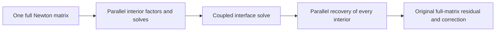

# EMI-03 algebraic decomposition experiment

The first exact Schur-complement prototype is **not selected for the transient
executor**. It passes the retained matrix checks, but its best four-block replay
takes 171.651 us for a batch of nine matrices versus 106.455 us for the selected
resident factor/solve implementation on those same matrices. That is about 61%
slower. EMI-03 remains incomplete; none of its full-study performance gates are
established by this experiment.

## What was decomposed

The 185-variable compiled circuit can be partitioned into independent matrix
interiors coupled through an interface. The first partition has 13 interface
variables and 13 interiors, including four 31-variable transistor interiors and
one 36-variable passive-network interior. Promoting the chassis variable `ch`
to the interface produces 14 interface variables and 15 interiors of sizes
`6, 31, 1, 31, 1, 2, 2, 27, 31, 1, 31, 1, 2, 2, 2`.

These are subdivisions of one Newton matrix. They are not separate circuit
trajectories. The intended transient integration would retain one full state,
one timestep controller, one convergence decision and one rollback for the
complete inverter/filter/load/chassis circuit. No stale boundary values or
independent leg simulations are introduced.

For each interior, the original equations have the form

```text
D_i z_i + E_i y = b_i
sum(F_i z_i) + C y = b_y
```

The prototype factors the interiors concurrently, computes
`P_i = solve(D_i, E_i)` and `q_i = solve(D_i, b_i)`, then solves the interface:

```text
S = C - sum(F_i P_i)
g = b_y - sum(F_i q_i)
S y = g
z_i = q_i - P_i y
```

Only structurally connected columns of `E_i` are solved. All original variables
are reconstructed. The original 185-variable residual supplies a mandatory
correction, and the host independently checks the full original matrix with
`ValidateSparseSolution` and fresh FP64 KLU solves. The prototype never forms an
explicit inverse.



A singular interior is a failed partition, not proof that the complete circuit
Jacobian is singular. The probe rejects that case. A production implementation
would need bounded repartitioning or a full GPU solve. A singular interface is
also rejected, including for zero RHS. Neither case permits CPU fallback to be
hidden inside an accepted GPU job.

## Evidence and limits

The retained [evidence](evidence/emi03/diagnostics/schur-decomposition/README.md)
contains 144 matrices: BE and TRAP companion Jacobians at eight selected accepted
states from fresh CPU trajectories for all nine candidate/corner cases through
20 us. RHS vectors are manufactured independently from those Jacobians. These are
accepted-state matrix samples, not every Newton trial, the complete 200 us
trajectory, DPT qualification, or the frozen q0/q1/q2 corpus.

The final prototype passes 576 matrix checks: both one-block and four-block
mappings, each with the manufactured RHS and a zero RHS. Its largest infinity-norm
difference from KLU, scaled by `max(1, ||x_KLU||_inf)`, is `1.235e-13`; its largest componentwise
backward error is `6.717e-17`. Both mappings also reject the local-singular/
global-nonsingular fixture and the singular-interface/zero-RHS fixture. All four
CUDA sanitizer tools pass on the final Schur validation run.

The timing screen uses one warmup and nine measurements, each containing 100
repeated factor/solve/correction iterations. Batch sizes are 1, 9 and 16; the
16-matrix case repeats seven of the nine cases. Device-event timing excludes
preparation, upload, CPU certification and all transient, waveform and spectral
work. It is not an EMI-03 throughput measurement.

| Matrix replay, batch of nine | One block per matrix | Four-block cluster per matrix |
| --- | ---: | ---: |
| Initial dense/local-array prototype | 5,430.054 us | 4,774.702 us |
| Sparse connections and shared scratch | 380.481 us | 396.946 us |
| Compact pivot updates | 315.531 us | 343.156 us |
| Cooperative RHS/row solves | 228.401 us | 218.820 us |
| Final chassis-interface partition | 185.609 us | 171.651 us |
| Selected resident factor/solve replay | 106.455 us | — |

The selected implementation's comparison reuses its actual ordering, GPU pivot
discovery, sparse factor and linear-validation routines. It forces a fresh
numeric factor each iteration so factor reuse cannot favor the baseline. All
26,000 measured/warmup solves have one correction and zero dense fallbacks. It
uses the same nine matrices, RHS vectors, repetition counts and original-matrix
host checks. Its copied diagnostic adapter is archived rather than maintained as
a second solver implementation.

Hardware profiles confirm that the four-block version launches 64 blocks for
16 matrices, with four blocks per cluster. Added parallelism does not eliminate
the serial interface or the extra response-column solves. The early dense
prototype wasted work on zeros and thread-private arrays. Sparse storage and
cooperative work assignment remove much of that overhead, but the matched
comparison still rejects this implementation. The matrix replay must not be
converted into a claimed reduction of the earlier 46.3-second ensemble timing.

## Auxiliary elimination

A separate [diagnostic](evidence/emi03/diagnostics/auxiliary-decomposition/README.md)
now eliminates the 40 isolated grounded voltage drivers algebraically on the
GPU. Their 80 variables are reconstructed from a 105-variable core. Four
dependency levels propagate numerical coefficients through the existing graph,
without expanding the 892-node expression representation into duplicated trees.
The original 185-variable residual supplies bounded correction and certification;
driver currents retain the original GMIN contribution. All 288 manufactured/zero
RHS checks pass, and an actually singular Jacobian with zero RHS is rejected.

The core with AMD ordering takes 74.532 us in the same nine-matrix timing screen,
versus 106.455 us for the selected full solver. This is a promising matrix-level
result, not a measured change to the transient or full study. Narrower factor
synchronization and interior-first ordering are slower and rejected. Combining
the reduction with four-block Schur decomposition is also slower, even when its
repeated-matrix screen optimistically reuses linear-interior factors and excludes
auxiliary reduction/recovery costs.

A further exact structural partition confines the reduced system's nonlinear
entries to a 25-variable interface and leaves an 80-variable linear interior.
Its offline reconstruction/correction proof passes all 144 original matrices;
there is no GPU timing or transient qualification for this partition. Reusing
that linear work requires checking the actual companion matrix whenever the
timestep changes. It cannot be inferred from repeated copies of one matrix.

Evaluating the isolated auxiliary equations directly at Newton trial states was
also tested in a real short transient. It passes all eleven resident tests and
ten waveform comparisons, but takes 2.541 s versus 1.980 s for the selected
solver. The additional evaluation work outweighs fewer factor/solve operations,
so this experimental projection is removed. Its sources, initial layout failure,
corrected tests and all trajectories remain in the auxiliary evidence archive.

Actual reduced-matrix transient integration, complete CPU/external qualification and both
independent performance invocations remain required. None of these prototypes
is a selected or qualified optimization.

The frozen median, p95, cold-run, resource and complete-job gates remain those in
[the experiment contract](emi01-gpu-experiment-contract.md). CPU FP64 KLU remains
the correctness authority and supported no-GPU implementation.

A subsequent [time-window decomposition probe](emi03-time-window-decomposition.md)
exposes parallelism across coupled timesteps. Its matrix and bounded nonlinear
window results remain separate from complete transient acceptance.
