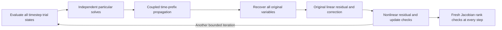

# EMI-03 time-window decomposition research

EMI-03 remains incomplete. This experiment exposes parallelism across timesteps
while retaining all 185 variables of the coupled inverter/filter/load/chassis
circuit. It is a fixed-schedule numerical probe, not the transient executor or a
full-study performance result. The frozen median, p95, cold-run, correctness and
resource gates in the [experiment contract](emi01-gpu-experiment-contract.md)
remain unchanged. The [retained evidence](evidence/emi03/diagnostics/time-window-decomposition/README.md)
includes successful runs, rejected windows and failed tool invocations.

## Mechanism

For a window with a constant backward-Euler step and a fixed Newton/chord matrix,
the coupled linear equations are

```text
A x[k] - B x[k-1] = b[k],   B = C/h.
```

The 51 nonzero columns of `C` give an exact column-selector factorization
`B = U V^T`. There is no numerical rank truncation. Compute `R = solve(A, U)`
and `T = V^T R`, then solve all particular right-hand sides independently:

```text
z[k] = solve(A, b[k])
y[k] = T y[k-1] + V^T z[k]
x[k] = z[k] + R y[k-1].
```

A prefix scan evaluates the recurrence using cached powers of `T`. The initial
boundary is the complete physical initial state; each later boundary is coupled
to every preceding step through the recurrence. No leg, filter, load or chassis
runs as an independent electrical trajectory. All states and branch currents
are reconstructed.

For a nonlinear window, the affine RHS is recomputed from the complete original
behavioral expressions at every trial state. A bounded chord iteration solves
all timesteps together. Its candidate trajectory receives full nonlinear
residual and update checks, including the original reactive-coordinate update
bounds. Every accepted timestep also receives a fresh GPU Jacobian factorization
to establish actual nonsingularity, followed by independent CPU residual,
Jacobian-rank and sequential-KLU state checks in the probe.

The full original per-step linear residual drives a mandatory first nonzero
correction and at most four corrections. Both the row-equilibrated normwise
`1e-10` and componentwise `1e-5` guards apply to the recovered trajectory. Internal
transfer columns and particular solutions are preconditioner work: their
normwise guards are checked, but they are not individually certified physical
timestep states. Requiring componentwise certification of those intermediate
vectors rejected near-zero rows; those failed attempts are retained. No guard
on an accepted full state is relaxed.



## Measurements so far

The manufactured linear screen uses the nine captured switching Jacobians,
case-specific mass matrices, window lengths 8, 32, 128 and 512, one warmup and
nine measurements. A separate CPU-only executable generates 4,608 sequential
KLU reference states. Every GPU result is independently checked on the CPU.
Preparation, factor/transfer construction and final CPU certification are
outside these device-event timings.

| Nine fixed-matrix windows | Sequential GPU | Parallel prefix GPU |
| --- | ---: | ---: |
| 8 steps | 0.567 ms | 0.762 ms |
| 32 steps | 2.225 ms | 0.794 ms |
| 128 steps | 8.852 ms | 1.448 ms |
| 512 steps | 35.356 ms | 4.691 ms |

The maximum absolute difference from the fresh sequential KLU states is
`5.844e-11`. The parallel path performs one correction per particular solve and
one full-window correction, with zero dense retries in this screen. This is a
matrix-level result, not a comparison against CPU study throughput.

Hardware counters on the preceding implementation showed one active block per
SM, 16.63% achieved occupancy and substantial barrier stalls. Its triangular
solve occupied one warp within a 256-thread block. Packing eight independent
right-hand sides into each block reduces the 512-step window from 10.445 ms to
4.691 ms without changing the recovered results. The original measured profile
belongs to the preceding implementation; its occupancy is not attributed to the
new kernel.

The nonlinear screen begins at independently captured states near the 1 us
switching edge. Each case keeps its captured timestep, which can be much smaller
than its maximum allowed timestep. All nine cases pass for window lengths 8,
32 and 128. Three pass at 512; six reject after bounded nonlinear backtracking.
The 30 passing windows contain 3,048 original timestep states. A separate
offline NumPy feasibility implementation has a different initial backtracking
policy and passes 24 windows; it is not substituted for the GPU results.

The retained ordinary-graph implementation places one complete nonlinear
iteration, including the original linear residual and correction, into a CUDA
graph. The host makes bounded convergence/backtracking decisions between
iterations. In the matched 128-step nonlinear screen, each case has one warmup
and nine alternating measurements against the selected GPU Newton/BE step
implementation. These are individual circuit windows, not nine simultaneous
jobs. CPU validation follows every result. The parallel graph takes 4.34–5.37 ms
per window; sequential GPU execution takes 35.54–45.73 ms, an 8.04–10.34x ratio.

Seven additional reference/nominal starting states cover initialization,
turn-off recovery, turn-on ringing, and later portions of the cycle. Together,
the two screens pass 56 of 64 windows, containing 6,784 distinct original
accepted timestep states; eight 512-step windows reject after bounded nonlinear
backtracking. The additional 128-step windows take 2.36–16.67 ms versus
22.80–47.31 ms sequentially. The weakest ratio is 2.84x during turn-on ringing,
where a fixed Jacobian requires more nonlinear iterations. Some fixed schedules
cross source breakpoints; these are discretized-equation probes, not accepted
adaptive transient trajectories.

These timings include graph execution and completion readback, but exclude
preparation, transfer construction, graph construction/instantiation and final
CPU validation. Neither method includes adaptive error estimation or complete
study output. First-launch, setup and rejected-window costs must be charged in
any integrated result.

All four Compute Sanitizer tools pass on the final ordinary-graph implementation
for the reference/nominal 128-step switching window. An earlier initialization
check caught padding bytes in the returned status structure; an explicit zeroed
reserved field fixes that issue. The manufactured matrix implementation also
passes memory, synchronization and initialization checking on its complete
validation invocation; race checking covers all launches of the new packed-warp
kernel, in addition to the preceding implementation's full race-check run.
These scopes do not imply sanitizer coverage of every nonlinear window.

An earlier conditional-graph implementation executes all bounded loops on the
device and is faster in ordinary runs, but its sanitizer invocation fails with
`cudaErrorUnknown`. Both a one-level and a nested conditional loop reproduce that
failure in a tiny program with no solver code; ordinary execution passes. This
isolates a tool/runtime interaction but does not establish sanitizer qualification
for the conditional implementation. Its source, successful numerical runs and
failed sanitizer runs are retained separately. It is not the implementation
selected for the next transient experiment.

## Required integration and acceptance work

A complete implementation still needs to advance from the true initial state,
choose and reject windows without any future CPU trajectory, estimate timestep
error, land on source breakpoints, preserve complete rollback, refresh/rebuild
preconditioners when needed, and stream every required accepted output. Long
windows cannot be assumed to converge. The fixed-matrix/constant-step setup
cannot be reused after its numerical identity changes.

An intended next experiment uses a coupled fine-step window and independent
coarse steps anchored at each fine interval's actual initial state. That can
provide the existing step-doubling comparison in parallel. It has not yet been
implemented or qualified. No full transient speedup, q0/q1/q2 qualification,
ngspice agreement, full-study throughput, cold-run gate or dispatch eligibility
is established here.

The manual `testonly` probes are separate from the selected resident executor.
CPU FP64 KLU remains authoritative. No CPU numeric solve is hidden inside the
GPU window computation; CPU references and final certification are explicit
research checks.

NVIDIA documents the device-controlled graph mechanism in its
[CUDA 13.0 conditional graph documentation](https://docs.nvidia.com/cuda/archive/13.0.0/cuda-c-programming-guide/index.html#conditional-graph-nodes).
The time-parallel literature supplies context, not a convergence guarantee for
this behavioral MNA system: see
[50 Years of Time Parallel Time Integration](https://www.unige.ch/~gander/Preprints/50YearsTimeParallel.pdf).
