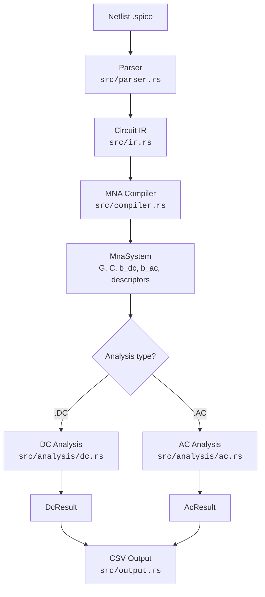
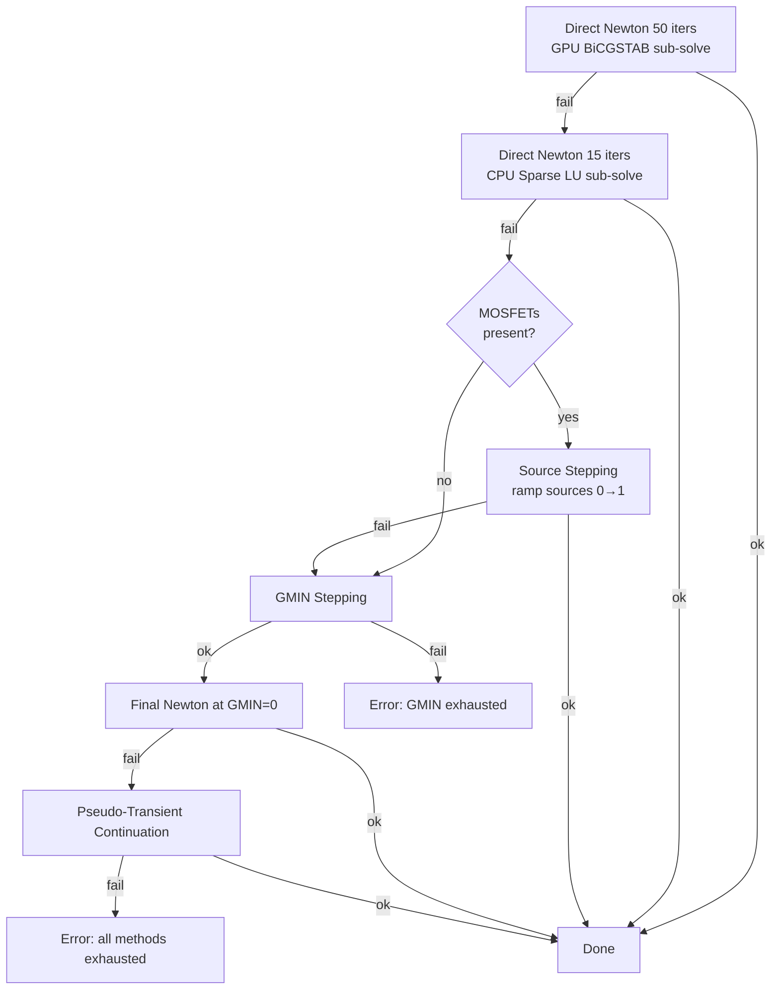
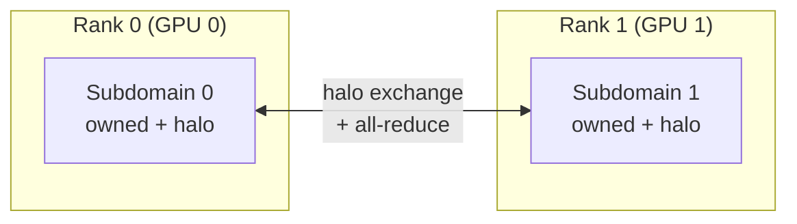
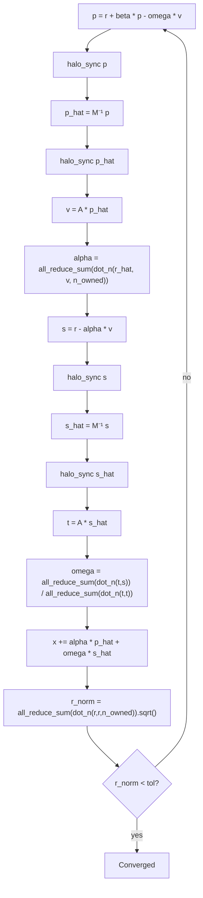
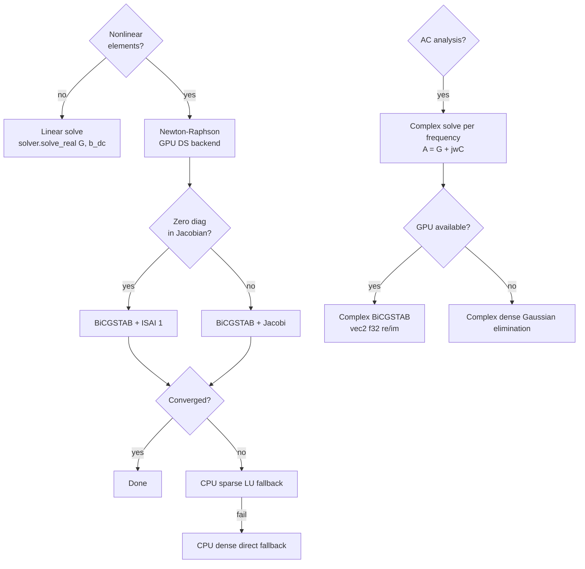

# Solver Reference

Detailed reference for contributors working on the Ohmnivore solver. Covers every stage of the solve pipeline, the algorithms used, where each stage runs (CPU/GPU/MPI), and which source files to look at.

## 1. Pipeline Overview



The solver sits between the compiler and output stages. It receives an `MnaSystem` containing sparse CSR matrices and device descriptors, and returns node voltages and branch currents.

## 2. MNA Compilation

**File:** `src/compiler.rs` — **Runs on:** CPU

The compiler transforms a `Circuit` IR into an `MnaSystem`. The process has five steps:

1. **Node registration.** Collect unique non-ground node names, assign integer indices. Ground (`"0"`, `"GND"`) is excluded from the matrix.

2. **Branch variable allocation.** Voltage sources and inductors each add a branch current variable. The matrix dimension is `n_nodes + n_branches`.

3. **Stamping.** Each component accumulates (row, col, value) triplets into G and C matrices and fills the RHS vectors `b_dc` / `b_ac`:

   | Component | G-matrix stamps | C-matrix stamps | RHS stamps |
   |-----------|----------------|-----------------|------------|
   | Resistor R (i,j) | ±1/R at (i,i), (j,j), (i,j), (j,i) | — | — |
   | Capacitor C (i,j) | — | ±C same pattern | — |
   | Inductor L (i,j), branch k | KCL coupling: ±1 between nodes and row n+k | C(n+k, n+k) = -L | — |
   | Voltage source V, branch k | KCL coupling: ±1 between nodes and row n+k | — | b_dc[n+k] = V_dc |
   | Current source I (n+, n-) | — | — | b_dc[n+] -= I, b_dc[n-] += I |
   | Diode/BJT/MOSFET | Placeholder zeros at stamp positions | — | — |

   Nonlinear elements stamp zeros to reserve their sparsity pattern. The actual conductance values are written by GPU shaders during Newton iteration.

4. **GMIN injection.** A small conductance (1e-12) is added to every node diagonal to prevent singular matrices when nodes are only connected through off transistors.

5. **CSR construction and descriptor resolution.** Triplets are assembled into CSR format. For each nonlinear device, the compiler resolves the CSR value-array indices where the GPU shaders will write stamps, producing `GpuDiodeDescriptor`, `GpuBjtDescriptor`, or `GpuMosfetDescriptor` structs.

### GPU Descriptor Structs

Each descriptor is a `#[repr(C)]` bytemuck `Pod` struct uploaded directly to GPU buffers:

| Struct | Size | Key fields |
|--------|------|------------|
| `GpuDiodeDescriptor` | 48 bytes (12 × u32) | anode/cathode node indices, Is, nVt, 4 G-matrix CSR indices, 2 RHS indices |
| `GpuBjtDescriptor` | 96 bytes (24 × u32) | C/B/E node indices, polarity, Is/Bf/Br/nF_Vt/nR_Vt, `node_fixed` flags, 9 G-matrix indices, 3 RHS indices |
| `GpuMosfetDescriptor` | 64 bytes (16 × u32) | D/G/S node indices, polarity, Vto/Kp/Lambda, packed `node_fixed`, 6 G-matrix indices, 2 RHS indices |

Ground-connected terminals use `u32::MAX` as a sentinel — shaders skip those stamp positions. The `node_fixed` flags mark nodes driven by voltage sources so the voltage limiting shaders leave them unchanged.

## 3. DC Analysis — Linear Path

**File:** `src/analysis/dc.rs` — **Runs on:** CPU dispatches, solver is pluggable

For circuits with no diodes, BJTs, or MOSFETs, the DC operating point is a single linear solve:

```
Gx = b_dc
```

The `LinearSolver` trait dispatches to either `GpuSolver` (BiCGSTAB on GPU) or `CpuSolver` (dense Gaussian elimination). The solution vector `x` contains node voltages followed by branch currents.

## 4. DC Analysis — Nonlinear Path (Newton-Raphson)

**Files:** `src/analysis/dc.rs`, `src/solver/newton.rs` — **Runs on:** GPU (DS precision) with CPU fallbacks

When the circuit contains nonlinear elements, the DC operating point requires iterative Newton-Raphson. The entire Newton loop runs on GPU using double-single (DS) precision.

```mermaid
flowchart TD
    subgraph newton["Newton-Raphson Iteration (GPU DS)"]
        A[Save x → x_old] --> B
        B[Device Evaluation<br/>diodes, BJTs, MOSFETs] --> C[Jacobian Assembly<br/>copy base G/b + stamp nonlinear terms]
        C --> D{NaN check<br/>CPU download}
        D -->|clean| E[Linear Sub-solve]
        D -->|NaN/Inf| ERR[Abort: numerical error]
        E --> F[Voltage Limiting<br/>BJT pnjlim, MOSFET race-free]
        F --> G{Converged?<br/>max |x - x_old| < tol}
        G -->|no| A
        G -->|yes| H[Return solution]
    end
```

**Entry:** `newton_solve()` in `src/solver/newton.rs`

### 4a. Device Evaluation

**Runs on:** GPU (DS precision shaders)

Each device type has an evaluation shader that reads node voltages from the current solution vector and computes currents and conductances:

**Diode** — Shockley equation:
- `i_d = Is * (exp(v_d / nVt) - 1)`
- `g_d = i_d / nVt + GMIN`
- Output: 4 DS floats (i_d, g_d as hi/lo pairs)

**BJT** — Ebers-Moll model:
- Forward/reverse junction currents from V_BE and V_BC
- Collector current `I_C = I_F - I_R/Br`, base current `I_B = I_F/Bf + I_R/Br`
- Four Jacobian partial derivatives: dI_C/dV_BE, dI_C/dV_BC, dI_B/dV_BE, dI_B/dV_BC
- Output: 12 DS floats (6 values × hi/lo)

**MOSFET** — SPICE Level-1:
- Three regions: cutoff (V_GS < Vto), linear, saturation
- `I_D = Kp * ((V_GS - Vto) * V_DS - 0.5 * V_DS^2) * (1 + lambda * V_DS)` (linear region)
- Transconductance `g_m = dI_D/dV_GS`, output conductance `g_ds = dI_D/dV_DS`
- Smooth subthreshold transition near Vto to avoid discontinuities
- Output: 8 DS floats (4 values × hi/lo)

### 4b. Jacobian Assembly

**Runs on:** GPU (DS precision shaders)

Two-phase assembly:
1. **Copy base values.** The base G-matrix values and RHS vector (from the compiler) are copied to output buffers in DS precision.
2. **Stamp nonlinear terms.** Device conductances are added to the G-matrix at the CSR indices recorded in the descriptors. Norton companion currents are stamped into the RHS.

Each device type has its own assembly shader (`assemble_matrix_stamp_ds`, `assemble_bjt_stamps`, `assemble_mosfet_stamps`).

### 4c. Linear Sub-solve

The assembled Jacobian system `J * dx = -F(x)` is solved each Newton iteration. Three backends are available:

| Mode | Backend | Precision | When used |
|------|---------|-----------|-----------|
| `GpuBicgstab` | GPU BiCGSTAB (DS) | ~f64 via DS | Default for all Newton iterations |
| `CpuSparseLu` | faer sparse LU | Native f64 | Fallback when BiCGSTAB fails |
| `CpuDirect` | Dense Gaussian elimination | Native f64 | Last-resort fallback |

**Preconditioner selection** (for GPU BiCGSTAB):
- **Jacobi** — used when all diagonal entries are nonzero. Computes `M^{-1} = diag(1/A_ii)`.
- **ISAI(1)** — used when zero diagonals exist (voltage source rows). Computes sparse approximate inverses `M_L ≈ L^{-1}`, `M_U ≈ U^{-1}` from an LU factorization. Apply is two SpMVs: `z = M_U * (M_L * r)`.

The preconditioner is recomputed from the assembled Jacobian each Newton iteration.

### 4d. Voltage Limiting

**Runs on:** GPU (DS precision shaders)

After the linear solve produces a new solution vector, voltage limiting prevents Newton overshoot in exponential PN junctions.

**BJT (SPICE pnjlim):** Clamps V_BE and V_BC swing per iteration. If `delta > V_crit`, applies `v_new = v_old + Vt * ln(delta/Vt + 1)` — a smooth saturation that prevents exponential runaway. Skips nodes marked as voltage-source-constrained (`node_fixed`).

**MOSFET (race-free two-pass):** Multiple MOSFETs can share nodes, so a naive per-device clamp creates data races. Instead:
1. **Reduce pass:** Each MOSFET computes its ideal per-node scale factor and atomically updates a shared per-node minimum.
2. **Apply pass:** The uniform scale factor is applied to each node's voltage update.

**Diode:** Voltage limiting is embedded in the convergence check shader — the diode junction voltage is clamped inline.

### 4e. Convergence Check

**Runs on:** GPU reduction → CPU

The convergence criterion is `max(|x_new - x_old|) < abs_tol` (default 1e-4). This is computed as a workgroup-local max reduction on GPU, with partial maxes read back to CPU for the final comparison. A NaN/Inf flag is also propagated — if any element is non-finite, the iteration aborts.

After convergence, the solution is downloaded to CPU and double-checked for NaN/Inf (WGSL NaN comparison is implementation-defined, so GPU detection is unreliable).

## 5. Convergence Aid Cascade

When direct Newton-Raphson fails (ill-conditioned Jacobian, poor initial guess), the DC analysis falls through a cascade of continuation methods. Each method produces a good initial guess for the next.



### 5a. Source Stepping

**File:** `src/analysis/dc.rs` (`run_source_stepping`) — **Only for MOSFET circuits**

Gradually ramps all independent sources from 0 to full value by scaling the RHS: `b_scaled = alpha * b_dc`.

- At low alpha, MOSFETs operate in cutoff or weak inversion with small voltages — the Jacobian is well-conditioned.
- Each converged step provides the initial guess for the next.
- Adaptive schedule: doubles the step size on success, bisects on failure.
- Stall detection: aborts if the step size drops below 1e-6.

### 5b. GMIN Stepping

**File:** `src/analysis/dc.rs` (main `run_nonlinear` loop)

Adds extra conductance `GMIN_extra` to all node diagonals, regularizing the Jacobian. Starts large (1e-1) and progressively reduces toward zero.

**Adaptive schedule:**
- **On success:** Record current level, attempt 1000× jump (multiply by 1e-3).
- **On failure:** Subdivide with 10× steps from the last successful level.
- **Exhaustion:** Gives up after 13 subdivisions.
- **Target:** Reach GMIN < 1e-13, then attempt final solve at GMIN = 0.

Each GMIN step tries GPU BiCGSTAB first, then falls back to CPU sparse LU before declaring failure and subdividing.

### 5c. Pseudo-Transient Continuation

**File:** `src/analysis/dc.rs` (`run_pseudo_transient_continuation`)

Last resort, attempted only if GMIN stepping succeeds but the final GMIN=0 solve fails. Adds diagonal damping and anchors the RHS to the previous solution:

```
G_modified = G + alpha * I  (node rows only)
b_modified = b + alpha * x_prev
```

This creates a homotopy from a heavily damped system (easy to solve) to the true DC system (alpha = 0).

**Adaptive schedule:** 100× drops on success, 10× subdivisions on failure. Alpha range: 1e-1 → 1e-8, then final solve at alpha = 0.

## 6. AC Analysis

**File:** `src/analysis/ac.rs` — **Runs on:** CPU orchestrates, solver is pluggable

AC analysis performs a frequency sweep, solving a complex linear system at each frequency point:

```
(G + jωC) x = b_ac
```

where `ω = 2πf` and `j` is the imaginary unit.

**Frequency generation** by sweep type:
- **DEC:** Logarithmic, `n_points` per decade. `f_i = f_start * 10^(i/n_points)`.
- **OCT:** Logarithmic, `n_points` per octave. `f_i = f_start * 2^(i/n_points)`.
- **LIN:** Linear, `n_points` total evenly spaced.

The complex matrix `A = G + jωC` is formed by `sparse::form_complex_matrix()`, then solved via the `LinearSolver` trait. The GPU path uses complex BiCGSTAB with `vec2<f32>` representing (re, im) pairs.

## 7. GPU Backends and Precision

### 7a. f32 Backend (WgpuBackend)

**Files:** `src/solver/gpu.rs`, `src/solver/backend.rs`, `src/solver/gpu_shaders.rs`

The standard GPU backend using WebGPU (wgpu — Vulkan/Metal/DX12). All GPU computation is f32; the CPU interface converts f64 ↔ f32 on upload/download.

**`SolverBackend` trait operations:** `spmv`, `dot`, `axpy`, `scale`, `copy`, `jacobi_apply`.

**WGSL compute shaders** (workgroup size 64):
- `spmv_real` — CSR sparse matrix-vector multiply
- `dot_product_reduce` — workgroup-local reduction producing partial sums
- `axpy`, `scale`, `copy` — vector arithmetic
- `jacobi_apply` — diagonal preconditioner: `out[i] = diag[i] * in[i]`

Used for: linear circuit solves, AC analysis, and the distributed solver path.

### 7b. Double-Single Backend (WgpuDsBackend)

**Files:** `src/solver/ds_backend.rs`, `src/solver/ds_shaders.rs`, `src/solver/ds_nonlinear_shaders.rs`

DS (double-single) emulates ~f64 precision using paired f32 values (hi, lo) with ~48-bit mantissa. Each scalar is stored as two f32s:

```
f64_to_ds(v): hi = v as f32, lo = (v - hi as f64) as f32
ds_to_f64(hi, lo): hi as f64 + lo as f64
```

DS arithmetic (add, mul, div, exp) is implemented in WGSL using error-free transformations. This is necessary for Newton-Raphson because:
- BJT saturation currents (Is ~ 1e-14) underflow in f32.
- Small conductance differences in the Jacobian require more than 24-bit mantissa.

**Implements both `SolverBackend` and `NonlinearBackend`.** All Newton-Raphson operations (device eval, assembly, voltage limiting, convergence check, BiCGSTAB) run in DS precision on GPU.

### 7c. Shader Architecture

Shaders are defined as Rust string constants containing WGSL source. They are compiled at runtime by wgpu and cached as compute pipelines.

**Dispatch pattern:** Each shader is dispatched with `ceil(n / 64)` workgroups. Within a workgroup, thread `local_id` processes element `workgroup_id * 64 + local_id`, with bounds checking.

**Nonlinear shaders** (`ds_nonlinear_shaders.rs`):

| Shader | Input | Output | Purpose |
|--------|-------|--------|---------|
| `diode_eval_ds` | Solution vector, descriptors | i_d, g_d per diode | Shockley equation |
| `bjt_eval_ds` | Solution vector, descriptors | I_C, I_B, 4 Jacobian entries per BJT | Ebers-Moll |
| `mosfet_eval_ds` | Solution vector, descriptors | I_D, g_m, g_ds per MOSFET | Level-1 MOSFET |
| `assemble_matrix_copy_ds` | Base G values | Output G buffer | Copy base matrix |
| `assemble_matrix_stamp_ds` | Device outputs, descriptors | Output G buffer | Add nonlinear conductances |
| `assemble_rhs_stamp_ds` | Device outputs, descriptors | Output b buffer | Add Norton currents |
| `bjt_voltage_limit_ds` | x_old, x_new, descriptors | x_new (modified) | SPICE pnjlim |
| `mosfet_voltage_limit_reduce_ds` | x_old, x_new, descriptors | Per-node scale factors | Race-free reduce pass |
| `mosfet_voltage_limit_apply_ds` | x_new, scale factors | x_new (modified) | Race-free apply pass |
| `convergence_check_ds` | x_old, x_new | Partial maxes, NaN flag | Workgroup max reduction |

## 8. CPU Fallbacks

### Dense Direct Solver (CpuSolver)

**File:** `src/solver/cpu.rs`

Gaussian elimination with partial pivoting. Native f64 precision. Used as the last-resort fallback for small or singular systems. O(n^3) complexity.

### Sparse LU (faer)

**File:** `src/solver/sparse_direct.rs`

Uses the `faer` crate for sparse LU factorization. Native f64 precision. The primary CPU fallback for Newton sub-problems when GPU BiCGSTAB fails. Significantly faster than dense direct for sparse Jacobians.

Fallback chain within a single Newton step:
```
GPU BiCGSTAB (DS) → CPU sparse LU (f64) → CPU dense direct (f64)
```

The sparse LU result is checked for out-of-range values (`> f32::MAX`) before being uploaded back to GPU, since the DS backend cannot represent such values.

## 9. Distributed Solver

Ohmnivore supports multi-GPU and multi-node execution via domain decomposition with overlapping subdomains.



### 9a. Graph Partitioning and Subdomain Mapping

**File:** `src/solver/partition.rs` — **Runs on:** CPU

**`Partitioner` trait:** Takes an adjacency matrix and number of partitions, returns a partition ID per node.

**`MetisPartitioner`:** Wraps the `metis-rs` crate (pure Rust METIS implementation). Minimizes edge-cut — the number of edges crossing partition boundaries — to minimize communication.

**`SubdomainMap`:** Built from the partition assignment for a given rank. Provides:

- **Local ordering:** Owned nodes at indices `0..n_owned`, halo nodes at `n_owned..n_owned+n_halo`. This layout enables dot products over owned entries only (no double-counting) and restriction to owned nodes via simple slice.
- **Global ↔ local mapping:** `HashMap<usize, usize>` for index translation.
- **Neighbor communication info:** Per-neighbor `send_indices` (owned boundary nodes to send) and `recv_indices` (local halo positions to fill).
- **Extraction methods:** `extract_submatrix()` pulls the local CSR block, `extract_subvector()` pulls the local RHS, `scatter_to_global()` writes owned results back.

The overlap is 1 layer (1-hop neighbors of owned nodes), which is the standard for RAS preconditioning.

### 9b. Communication Backend

**File:** `src/solver/comm.rs` — **Trait:** `CommunicationBackend`

| Method | Purpose |
|--------|---------|
| `all_reduce_sum(local) -> global` | Collective sum across all ranks. Used for distributed dot products. |
| `all_reduce_max(local) -> global` | Collective max. Used for distributed convergence checks. |
| `all_reduce_sum_vec(local)` | Element-wise vector sum across ranks. Used for reassembling distributed solutions. |
| `halo_exchange(neighbors, send, recv)` | Point-to-point boundary value exchange with neighbor ranks. |
| `barrier()` | Synchronization fence. |

**Implementations:**
- **`SingleProcessComm`** (`src/solver/comm.rs`): No-op passthrough. All operations return their input unchanged. Used for single-GPU execution — the distributed code path degenerates to the single-GPU case with zero overhead.
- **`MpiComm`** (`src/solver/comm_mpi.rs`, behind `distributed` feature flag): Wraps MPI via the `mpi` crate. `all_reduce_sum` uses `MPI_Allreduce`, halo exchange uses non-blocking `MPI_Isend`/`MPI_Irecv`.

### 9c. Distributed BiCGSTAB

**File:** `src/solver/distributed_bicgstab.rs` — **Runs on:** GPU + MPI

The distributed BiCGSTAB is structurally identical to the single-GPU version with two modifications:

1. **Dot products** use `backend.dot_n(x, y, n_owned)` (sum over owned entries only) followed by `comm.all_reduce_sum()`. This avoids double-counting overlap nodes.

2. **Halo synchronization** before every SpMV and preconditioner apply. The `halo_sync` closure exchanges boundary values with neighbor ranks so that the local SpMV sees up-to-date neighbor data.



When `SingleProcessComm` is used with `n_owned == n_total`, this behaves identically to the non-distributed BiCGSTAB.

### 9d. RAS-ISAI Preconditioner

**File:** `src/solver/distributed_preconditioner.rs` — **Runs on:** CPU (distributed), GPU (local ISAI apply)

**Restricted Additive Schwarz (RAS)** with local ISAI(1) on each subdomain:

1. **Halo exchange.** Sync boundary values from neighbor ranks into local halo positions.
2. **Local ISAI apply.** Two SpMVs on the local subdomain matrix: `output = M_U * (M_L * input)`.
3. **Restrict to owned.** Discard halo entries in the output — only owned node results are meaningful.

Each subdomain computes its own ISAI factors independently. Communication happens only at the halo exchange step. The `RasIsaiPreconditioner` can be updated (recomputed) when the matrix values change during Newton iteration without changing the sparsity pattern.

**`DistributedPreconditioner` trait:**
```rust
fn apply_cpu(&self, input: &[f64], map: &SubdomainMap, comm: &dyn CommunicationBackend) -> Vec<f64>;
```

## 10. Solver Selection Logic

Summary decision tree for which solver path runs:



## Appendix: File Map

| File | Purpose | Runs on |
|------|---------|---------|
| `src/compiler.rs` | SPICE → MNA matrices + device descriptors | CPU |
| `src/analysis/dc.rs` | DC operating point orchestration + convergence cascade | CPU |
| `src/analysis/ac.rs` | AC frequency sweep | CPU |
| `src/analysis/transient.rs` | Transient (time-domain) analysis — BE/TRAP integration with adaptive timestep | CPU |
| `src/analysis/transient_source.rs` | Transient source waveform evaluation (PULSE, SIN, PWL, EXP) | CPU |
| `src/solver/mod.rs` | `LinearSolver` trait definition | — |
| `src/solver/newton.rs` | Newton-Raphson iteration loop | GPU (DS) + CPU |
| `src/solver/bicgstab.rs` | Right-preconditioned BiCGSTAB | Generic (`SolverBackend`) |
| `src/solver/backend.rs` | `SolverBackend` trait + `WgpuBackend` (f32) | GPU |
| `src/solver/ds_backend.rs` | `WgpuDsBackend` — DS precision backend | GPU |
| `src/solver/nonlinear.rs` | `NonlinearBackend` trait — device eval/assembly/limiting | GPU |
| `src/solver/gpu.rs` | `GpuSolver` — `LinearSolver` impl using wgpu | GPU |
| `src/solver/gpu_shaders.rs` | f32 WGSL compute shaders | GPU |
| `src/solver/ds_shaders.rs` | DS arithmetic WGSL shaders | GPU |
| `src/solver/ds_nonlinear_shaders.rs` | DS device evaluation + assembly shaders | GPU |
| `src/solver/preconditioner.rs` | ISAI preconditioner computation (LU + sparse approximate inverse) | CPU (rayon parallel) |
| `src/solver/cpu.rs` | Dense Gaussian elimination solver | CPU |
| `src/solver/sparse_direct.rs` | Sparse LU via faer | CPU |
| `src/solver/partition.rs` | METIS graph partitioning + `SubdomainMap` | CPU |
| `src/solver/comm.rs` | `CommunicationBackend` trait + `SingleProcessComm` | CPU |
| `src/solver/comm_mpi.rs` | `MpiComm` (behind `distributed` feature) | CPU + MPI |
| `src/solver/distributed_bicgstab.rs` | Distributed BiCGSTAB with all-reduce + halo exchange | GPU + MPI |
| `src/solver/distributed_preconditioner.rs` | RAS-ISAI distributed preconditioner | CPU + MPI |
| `src/solver/distributed_newton.rs` | Distributed Newton-Raphson routing | GPU + MPI |
